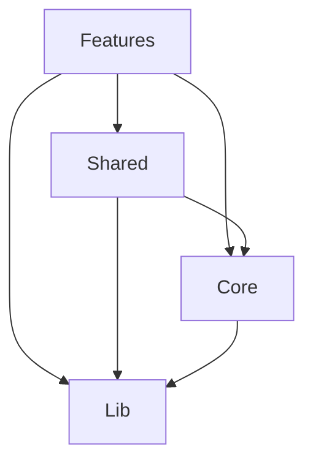

# 🚀 React FSD - Feature-Sliced Design Application

> A modern React application built with Feature-Sliced Design architecture, TypeScript, and cutting-edge tools for scalable frontend development.

[](https://www.typescriptlang.org/)
[](https://reactjs.org/)
[](https://vitejs.dev/)
[](https://tailwindcss.com/)
[](https://jestjs.io/)

## ✨ Features

- 🏗️ **Feature-Sliced Design (FSD)** - Scalable architecture for large applications
- ⚡ **Vite** - Lightning-fast build tool and development server
- 🔷 **TypeScript** - Full type safety with strict configuration
- ⚛️ **React 19** - Latest React with modern features
- 🎨 **ShadCN UI + Tailwind CSS** - Beautiful, accessible UI components
- 🔄 **TanStack Query** - Powerful data fetching and caching
- 🗺️ **TanStack Router** - Type-safe routing
- 🐻 **Zustand** - Lightweight state management
- 🧪 **Jest + RTL** - Comprehensive testing setup
- 🌍 **i18next** - Internationalization support
- 🎭 **MSW** - API mocking for development and testing
- 📏 **ESLint + Prettier** - Code quality and formatting
- 🪝 **Husky** - Git hooks for quality assurance

## 🏛️ Architecture

This project follows **Feature-Sliced Design** methodology with clear separation of concerns:

```text
src/
├── features/     # 🎯 Business features (auth, dashboard, etc.)
├── core/         # 🔧 App-level configuration (router, API, i18n)
├── shared/       # 🤝 Reusable components and utilities
├── lib/          # 📚 External library adaptations
└── styles/       # 🎨 Global styles and themes
```

### Dependency Flow



**Key Principles:**

- ✅ Downward dependencies only
- ❌ No circular dependencies
- 🔄 Cross-feature communication through shared layer

## 🚀 Quick Start

### Prerequisites

- **Node.js** 18+
- **npm** 9+
- **Git**

### Installation

```bash
# Clone repository
git clone https://github.com/your-org/react-fsd.git
cd react-fsd

# Install dependencies
npm install

# Start development server
npm run dev

# Open http://localhost:3000
```

### Available Scripts

```bash
# Development
npm run dev          # Start dev server with HMR
npm run build        # Build for production
npm run preview      # Preview production build

# Code Quality
npm run lint         # Run ESLint
npm run lint:fix     # Fix linting issues
npm run type-check   # TypeScript compilation check

# Testing
npm test             # Run tests in watch mode
npm run test:ci      # Run tests in CI mode
npm run test:coverage # Run tests with coverage report

# Utilities
npm run clean        # Clean build artifacts
```

## 📁 Project Structure

Detailed file structure:

```text
src/
├── features/                    # Business Features
│   ├── auth/                   # Authentication feature
│   │   ├── components/         # UI components
│   │   │   └── LoginForm/      # Login form component
│   │   ├── constants/          # Feature constants
│   │   ├── locales/           # i18n translations
│   │   ├── managers/          # Business logic
│   │   ├── mocks/             # MSW handlers
│   │   ├── models/            # TypeScript types
│   │   ├── pages/             # Route components
│   │   ├── queries/           # TanStack Query hooks
│   │   ├── routes/            # Route configuration
│   │   ├── schema/            # Validation schemas
│   │   ├── services/          # API services
│   │   └── stores/            # State management
│   ├── configs.ts             # Feature configuration
│   ├── locales.ts             # Locale aggregation
│   ├── mocks.ts               # Mock aggregation
│   └── routes.ts              # Route aggregation
│
├── core/                       # App Infrastructure
│   ├── api/                   # API configuration
│   ├── components/            # App-level components
│   ├── i18n/                  # i18n setup
│   ├── mock/                  # MSW configuration
│   └── router/                # Router setup
│
├── shared/                     # Shared Resources
│   ├── components/            # Reusable components
│   ├── models/                # Common types
│   └── utils/                 # Utility functions
│
├── lib/                        # Library Adaptations
│   └── shadcn/                # ShadCN UI customizations
│       ├── components/ui/     # UI components
│       └── utils/             # UI utilities
│
└── styles/                     # Global Styles
    └── globals.css            # Tailwind + CSS variables
```

</details>

## 🧩 Adding New Features

Follow our [Feature Development Guide](./docs/DEVELOPMENT.md) to add new features:

```bash
# 1. Create feature structure
mkdir -p src/features/dashboard/{components,constants,locales,managers,mocks,models,pages,queries,routes,schema,services,stores}

# 2. Implement feature slices (models → services → stores → components → pages)

# 3. Register in configuration
# Update: features/configs.ts, features/routes.ts, features/locales.ts
```

### Example Feature Structure

```typescript
// features/dashboard/models/dashboard.model.ts
export interface DashboardData {
  metrics: Metric[];
  charts: ChartData[];
}

// features/dashboard/services/dashboard.service.ts
export const dashboardService = {
  async getMetrics(): Promise<Metric[]> {
    const response = await apiClient.get('/dashboard/metrics');
    return response.data;
  },
};

// features/dashboard/stores/dashboard.store.ts
export const useDashboardStore = create<DashboardState>(set => ({
  data: null,
  isLoading: false,
  fetchData: async () => {
    // Implementation
  },
}));
```

## 🧪 Testing Strategy

We maintain **80% test coverage** with a comprehensive testing approach:

### Test Types

- **Unit Tests** (70%): Components, utilities, services
- **Integration Tests** (20%): Feature workflows
- **E2E Tests** (10%): Critical user journeys

### Running Tests

```bash
# Run all tests
npm test

# Run with coverage
npm run test:coverage

# Run specific test file
npm test LoginForm.test.tsx

# Run tests for specific feature
npm test -- --testPathPattern=features/auth
```

### Test Example

```typescript
describe('LoginForm', () => {
  it('should handle form submission with valid data', async () => {
    const user = userEvent.setup();
    const mockOnSubmit = jest.fn();

    render(<LoginForm onSubmit={mockOnSubmit} isLoading={false} />);

    await user.type(screen.getByLabelText(/username/i), 'testuser');
    await user.type(screen.getByLabelText(/password/i), 'password123');
    await user.click(screen.getByRole('button', { name: /login/i }));

    await waitFor(() => {
      expect(mockOnSubmit).toHaveBeenCalledWith({
        username: 'testuser',
        password: 'password123',
      });
    });
  });
});
```

## 🎨 UI Components

Built with **ShadCN UI** and **Tailwind CSS** for consistent, accessible design:

```typescript
import { Button } from '@/lib/shadcn/components/ui/button';
import { Input } from '@/lib/shadcn/components/ui/input';
import { Card } from '@/lib/shadcn/components/ui/card';

export const ExampleComponent = () => (
  <Card className="p-6">
    <Input placeholder="Enter text..." className="mb-4" />
    <Button className="w-full">
      Submit
    </Button>
  </Card>
);
```

### Theme Support

- 🌅 Light mode
- 🌙 Dark mode
- 🎨 CSS custom properties
- 📱 Responsive design
- ♿ Accessibility compliant

## 🌍 Internationalization

Multi-language support using **react-i18next**:

```typescript
// features/auth/locales/en.json
{
  "login": {
    "title": "Sign In",
    "usernameLabel": "Username",
    "passwordLabel": "Password",
    "loginButton": "Sign In"
  }
}

// Component usage
import { useTranslation } from 'react-i18next';

export const LoginForm = () => {
  const { t } = useTranslation('auth');

  return (
    <form>
      <h1>{t('login.title')}</h1>
      {/* Form fields */}
    </form>
  );
};
```

## 🔄 State Management

### Local State (Zustand)

```typescript
// Feature-specific state
export const useAuthStore = create<AuthState>(set => ({
  user: null,
  isAuthenticated: false,
  setUser: user => set({ user, isAuthenticated: !!user }),
  logout: () => set({ user: null, isAuthenticated: false }),
}));
```

### Server State (TanStack Query)

```typescript
// Data fetching with caching
export const useUsers = () => {
  return useQuery({
    queryKey: ['users'],
    queryFn: () => userService.getAll(),
    staleTime: 5 * 60 * 1000, // 5 minutes
  });
};
```

## 📚 Documentation

- 📖 **[Architecture Guide](./docs/ARCHITECTURE.md)** - Detailed FSD architecture
- 🛠️ **[Development Guide](./docs/DEVELOPMENT.md)** - Feature development process
- 🧪 **[Testing Guide](./docs/TESTING.md)** - Testing strategies and examples
- 🚀 **[Deployment Guide](./docs/DEPLOYMENT.md)** - Deploy to various platforms
- 🤝 **[Contributing Guide](./docs/CONTRIBUTING.md)** - How to contribute

## 🚀 Deployment

Deploy to multiple platforms with optimized builds:

```bash
# Build for production
npm run build

# Preview build locally
npm run preview
```

### Supported Platforms

- **Vercel** - Zero-config deployment
- **Netlify** - JAMstack deployment
- **GitHub Pages** - Static site hosting
- **Docker** - Containerized deployment

See [Deployment Guide](./docs/DEPLOYMENT.md) for detailed instructions.

## 🤝 Contributing

We welcome contributions! Please see our [Contributing Guide](./docs/CONTRIBUTING.md) for details.

### Development Workflow

1. Fork the repository
2. Create a feature branch: `git checkout -b feature/amazing-feature`
3. Make your changes following our [coding standards](./docs/CONTRIBUTING.md#code-standards)
4. Add tests for new functionality
5. Commit using [conventional commits](./docs/CONTRIBUTING.md#commit-message-format)
6. Push and create a Pull Request

### Code Quality

- ✅ TypeScript strict mode
- ✅ ESLint + Prettier
- ✅ Pre-commit hooks
- ✅ 80% test coverage requirement
- ✅ Automated CI/CD

## 📄 License

This project is licensed under the MIT License - see the [LICENSE](LICENSE) file for details.

## 🎯 Roadmap

- [ ] **Component Library** - Extract reusable components
- [ ] **Storybook Integration** - Component documentation
- [ ] **E2E Testing** - Playwright integration
- [ ] **Performance Monitoring** - Real user metrics
- [ ] **PWA Support** - Service worker integration
- [ ] **Micro-frontend** - Module federation setup

## 🙏 Acknowledgments

- [Feature-Sliced Design](https://feature-sliced.design/) - Architecture methodology
- [ShadCN UI](https://ui.shadcn.com/) - Beautiful component library
- [TanStack](https://tanstack.com/) - Powerful data management tools
- [Vite](https://vitejs.dev/) - Next generation frontend tooling

---

### Built with ❤️ using Feature-Sliced Design

For questions, issues, or contributions, please visit our [GitHub repository](https://github.com/your-org/react-fsd).
