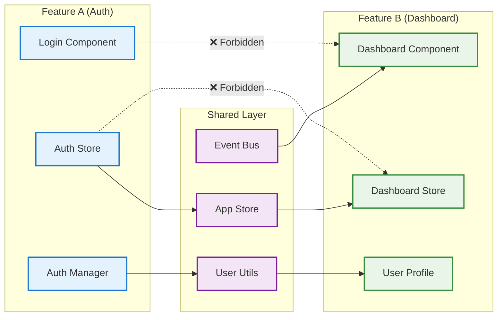
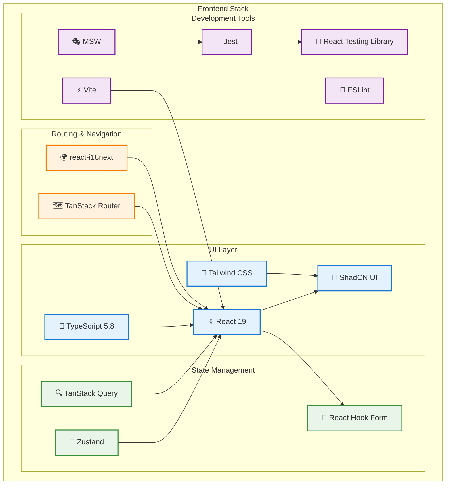

# 🏛️ Feature-Sliced Design (FSD) Architecture

## Current Implementation Status

This document describes the implemented FSD architecture with focus on layouts, guards, authentication patterns, and modern React practices.

## Technology Stack

- **Node.js** 20+ (LTS)
- **React** 19+ with modern features
- **TypeScript** 5.8+ with strict configuration
- **Vite** 7+ for build tooling
- **TailwindCSS** 4+ for styling
- **TanStack Router** for type-safe routing
- **TanStack Query** for server state management
- **Zustand** for client state management
- **Jest** + **React Testing Library** for testing
- **MSW** for API mocking

## Architecture Layers

### 🎯 **Core Layer** - Application Infrastructure

**Purpose**: Framework-agnostic foundational logic and app-level concerns

````text
core/
├── api/                  # API client configuration
│   └── index.ts         # Axios setup, interceptors
├── components/          # App-level components
├── i18n/               # Internationalization setup
│   └── index.ts        # i18next configuration
├── layouts/            # Application layout wrappers
│   ├── GlobalLayout.tsx # Global app concerns (providers, analytics)
│   ├── LayoutWrapper.tsx # Layout composition
│   └── index.ts
├── mock/               # MSW configuration
│   └── browser.ts      # Service worker setup
├── models/             # Core type definitions
│   └── layout.model.ts # Layout interfaces
└── router/             # Router configuration
    └── index.tsx       # TanStack Router setup

**Key Principle**: No business logic, only foundational services.

### 🚀 **Features Layer** - Business Logic

**Purpose**: Self-contained business features with their own guards, layouts, and logic

```text
features/
├── auth/                # Authentication feature
│   ├── components/      # Login forms, auth UI
│   ├── constants/       # Auth-related constants
│   ├── guards/          # AuthGuard, GuestGuard
│   ├── layouts/         # AuthLayout for auth pages
│   ├── locales/         # Auth translations
│   ├── managers/        # Auth business logic
│   ├── mocks/           # MSW handlers for auth
│   ├── models/          # Auth types and interfaces
│   ├── pages/           # Login, Register pages
│   ├── queries/         # TanStack Query hooks
│   ├── routes/          # Auth route definitions
│   ├── schema/          # Validation schemas
│   ├── services/        # Auth API services
│   ├── stores/          # Auth state management
│   └── utils/           # Auth utilities
├── home/                # Home feature
│   ├── constants/       # Home constants
│   ├── guards/          # Home-specific guards
│   └── routes/          # Home routes
├── configs.ts           # Feature configuration aggregation
├── guards.tsx           # Cross-feature guard utilities
├── locales.ts           # Locale aggregation
├── mocks.ts             # Mock aggregation
└── routes.ts            # Route aggregation
````

### 🤝 **Shared Layer** - Common Resources

**Purpose**: Reusable utilities and types used across features

```
shared/
├── models/
│   └── common.model.ts   # Guard interfaces, common types
├── utils/
│   └── common.utils.ts   # generateGuards, generateResources
└── pages/
    └── HomePage/         # Shared page components
```

## 🛡️ Guard System Implementation

### Architecture Philosophy

Guards follow FSD principles by living within their respective features, with shared types in the shared layer.

**Location Strategy**:

- `features/auth/guards/` - Auth-specific guards (AuthGuard, GuestGuard)
- `shared/models/common.model.ts` - Common guard interfaces
- `features/guards.tsx` - Optional cross-feature aggregation

### Usage Patterns

#### Direct Feature Imports (Recommended)

```typescript
// Within auth feature
import { GuestGuard } from '../guards';

// Cross-feature usage
import { AuthGuard } from '@/features/auth/guards';

// Route implementation
const homeRoute = createRoute({
  component: () => (
    <AuthGuard>
      <HomePage />
    </AuthGuard>
  ),
});
```

## 🎨 Layout System Implementation

### Layout Hierarchy

1. **GlobalLayout** - App-level concerns (analytics, providers, error boundaries)
2. **AuthLayout** - Auth-specific visual structure (branding, forms)
3. **Feature Layouts** - Feature-specific UI patterns

### GlobalLayout Simplification

**Philosophy**: GlobalLayout should handle global concerns, not visual layout.

```typescript
// Before: Mixed visual + global concerns
<div className="min-h-screen">
  <header>...</header>
  <main>{children}</main>
  <footer>...</footer>
</div>

// After: Pure global concerns
<>
  {/* TODO: Analytics, Error Boundaries, Providers */}
  {children}
</>
```

**Benefits**:

- ✅ Separation of concerns
- ✅ Visual layout flexibility per feature
- ✅ Easier testing and maintenance
- ✅ Ready for analytics/monitoring integration

graph TD
subgraph "Application Architecture"
subgraph "Features Layer (Business Logic)"
F1[👤 Auth Feature]
F2[📊 Dashboard Feature]
F3[⚙️ Settings Feature]
F4[🔍 Search Feature]
end

        subgraph "Shared Layer (Common Resources)"
            S1[🤝 Shared Components]
            S2[🛠️ Shared Utils]
            S3[📝 Shared Models]
            S4[💾 Shared Stores]
        end

        subgraph "Core Layer (App Infrastructure)"
            C1[🌐 Router]
            C2[🔗 API Client]
            C3[🌍 i18n]
            C4[🧪 MSW Config]
        end

        subgraph "Lib Layer (External Adaptations)"
            L1[🎨 ShadCN UI]
            L2[📚 Utils]
            L3[🎭 Theme]
        end
    end

    %% Dependencies (downward only)
    F1 --> S1
    F1 --> S2
    F1 --> S3
    F2 --> S1
    F2 --> S4
    F3 --> S2
    F4 --> S1

    F1 --> C1
    F2 --> C2
    F3 --> C3

    S1 --> L1
    S2 --> L2
    C1 --> L1

    %% Styling
    classDef featureLayer fill:#e1f5fe,stroke:#0288d1,stroke-width:2px
    classDef sharedLayer fill:#f3e5f5,stroke:#7b1fa2,stroke-width:2px
    classDef coreLayer fill:#e8f5e8,stroke:#2e7d32,stroke-width:2px
    classDef libLayer fill:#fff3e0,stroke:#f57c00,stroke-width:2px

    class F1,F2,F3,F4 featureLayer
    class S1,S2,S3,S4 sharedLayer
    class C1,C2,C3,C4 coreLayer
    class L1,L2,L3 libLayer

````

## Feature Internal Structure

Each feature follows a consistent internal structure for predictability and maintainability.

```mermaid
graph TD
    subgraph "Feature: Auth"
        subgraph "UI Layer"
            A1[📱 Components]
            A2[📄 Pages]
        end

        subgraph "Business Logic"
            A3[🧠 Managers]
            A4[💾 Stores]
            A5[🔍 Queries]
        end

        subgraph "Data Layer"
            A6[🌐 Services]
            A7[📋 Schema]
            A8[📊 Models]
        end

        subgraph "Configuration"
            A9[🗺️ Routes]
            A10[🔧 Constants]
            A11[🌍 Locales]
        end

        subgraph "Development"
            A12[🎭 Mocks]
            A13[🧪 Tests]
        end
    end

    %% Internal dependencies
    A1 --> A3
    A1 --> A4
    A1 --> A5
    A2 --> A1
    A2 --> A3
    A3 --> A6
    A3 --> A4
    A5 --> A6
    A6 --> A7
    A6 --> A8
    A9 --> A2
    A13 --> A12

    %% Styling
    classDef uiLayer fill:#bbdefb,stroke:#1976d2,stroke-width:2px
    classDef businessLayer fill:#c8e6c9,stroke:#388e3c,stroke-width:2px
    classDef dataLayer fill:#ffcdd2,stroke:#d32f2f,stroke-width:2px
    classDef configLayer fill:#f8bbd9,stroke:#c2185b,stroke-width:2px
    classDef devLayer fill:#ffe0b2,stroke:#f57c00,stroke-width:2px

    class A1,A2 uiLayer
    class A3,A4,A5 businessLayer
    class A6,A7,A8 dataLayer
    class A9,A10,A11 configLayer
    class A12,A13 devLayer
````

## Data Flow Architecture

This diagram shows how data flows through the application layers with proper separation of concerns.

```mermaid
sequenceDiagram
    participant U as 👤 User
    participant C as 📱 Component
    participant M as 🧠 Manager
    participant S as 💾 Store
    participant Q as 🔍 Query
    participant API as 🌐 Service
    participant BE as 🏢 Backend

    U->>C: User Action (e.g., Login)
    C->>M: Call Manager Method
    M->>S: Update Loading State
    M->>Q: Trigger Query
    Q->>API: API Call
    API->>BE: HTTP Request
    BE-->>API: Response Data
    API-->>Q: Processed Data
    Q-->>M: Query Result
    M->>S: Update State
    S-->>C: State Change
    C-->>U: UI Update

    Note over C,API: All layers follow FSD dependency rules
    Note over S: Global state accessible by components
    Note over Q: Server state managed separately
```

## Cross-Feature Communication

Demonstrates how features communicate through the shared layer, maintaining architectural boundaries.



## Technology Stack Integration

Shows how different technologies integrate within the FSD architecture.



## Development Workflow

Illustrates the typical development workflow when working with this architecture.


## Build & Configuration Architecture

### Modern Toolchain Setup

This project uses a modern, optimized toolchain designed for performance and developer experience:

#### Build Configuration (Vite 7+)

```typescript
// vite.config.ts - Modern build setup
export default defineConfig({
  plugins: [
    react(), // React support with Fast Refresh
    tailwindcss(), // TailwindCSS 4+ integration
  ],
  server: {
    port: 3000, // Consistent dev server port
    open: true, // Auto-open browser
  },
  resolve: {
    alias: {
      // Path mapping for clean imports
      '@': path.resolve(__dirname, './src'),
      components: path.resolve(__dirname, './src/components'),
      features: path.resolve(__dirname, './src/features'),
      core: path.resolve(__dirname, './src/core'),
    },
  },
});
```

#### TypeScript Configuration (5.8+)

```json
// tsconfig.json - Strict TypeScript setup
{
  "compilerOptions": {
    "target": "ES2022", // Modern JavaScript target
    "lib": ["ES2022", "DOM"], // Modern APIs
    "module": "ESNext", // ESM modules
    "moduleResolution": "bundler", // Vite-optimized resolution
    "strict": true, // Strict type checking
    "noUnusedLocals": true, // Enforce clean code
    "jsx": "react-jsx" // Modern JSX transform
  }
}
```

#### Package Configuration

```json
// package.json - Node 20+ requirement
{
  "type": "module", // ESM-first approach
  "engines": {
    "node": ">=20.0.0", // Node 20+ requirement
    "npm": ">=10.0.0" // npm 10+ requirement
  }
}
```

### Testing Architecture

- **Jest 30+** - Modern testing framework
- **React Testing Library 16+** - Component testing
- **MSW 2+** - API mocking
- **80% coverage** - Quality threshold

### Code Quality Pipeline

- **ESLint 9+** - Modern linting with flat config
- **Prettier 3+** - Code formatting
- **Husky** - Git hooks
- **TypeScript strict mode** - Type safety
