# 🏛️ Feature-Sliced Design (FSD) Architecture

## Architecture Layers

This diagram illustrates the Feature-Sliced Design architecture with clear dependency flow and layer responsibilities.

```mermaid
graph TD
    subgraph "Application Architecture"
        subgraph "Features Layer (Business Logic)"
            F1[👤 Auth Feature]
            F2[📊 Dashboard Feature]
            F3[⚙️ Settings Feature]
            F4[🔍 Search Feature]
        end

        subgraph "Shared Layer (Common Resources)"
            S1[🤝 Shared Components]
            S2[🛠️ Shared Utils]
            S3[📝 Shared Models]
            S4[💾 Shared Stores]
        end

        subgraph "Core Layer (App Infrastructure)"
            C1[🌐 Router]
            C2[🔗 API Client]
            C3[🌍 i18n]
            C4[🧪 MSW Config]
        end

        subgraph "Lib Layer (External Adaptations)"
            L1[🎨 ShadCN UI]
            L2[📚 Utils]
            L3[🎭 Theme]
        end
    end

    %% Dependencies (downward only)
    F1 --> S1
    F1 --> S2
    F1 --> S3
    F2 --> S1
    F2 --> S4
    F3 --> S2
    F4 --> S1

    F1 --> C1
    F2 --> C2
    F3 --> C3

    S1 --> L1
    S2 --> L2
    C1 --> L1

    %% Styling
    classDef featureLayer fill:#e1f5fe,stroke:#0288d1,stroke-width:2px
    classDef sharedLayer fill:#f3e5f5,stroke:#7b1fa2,stroke-width:2px
    classDef coreLayer fill:#e8f5e8,stroke:#2e7d32,stroke-width:2px
    classDef libLayer fill:#fff3e0,stroke:#f57c00,stroke-width:2px

    class F1,F2,F3,F4 featureLayer
    class S1,S2,S3,S4 sharedLayer
    class C1,C2,C3,C4 coreLayer
    class L1,L2,L3 libLayer
```

## Feature Internal Structure

Each feature follows a consistent internal structure for predictability and maintainability.

```mermaid
graph TD
    subgraph "Feature: Auth"
        subgraph "UI Layer"
            A1[📱 Components]
            A2[📄 Pages]
        end

        subgraph "Business Logic"
            A3[🧠 Managers]
            A4[💾 Stores]
            A5[🔍 Queries]
        end

        subgraph "Data Layer"
            A6[🌐 Services]
            A7[📋 Schema]
            A8[📊 Models]
        end

        subgraph "Configuration"
            A9[🗺️ Routes]
            A10[🔧 Constants]
            A11[🌍 Locales]
        end

        subgraph "Development"
            A12[🎭 Mocks]
            A13[🧪 Tests]
        end
    end

    %% Internal dependencies
    A1 --> A3
    A1 --> A4
    A1 --> A5
    A2 --> A1
    A2 --> A3
    A3 --> A6
    A3 --> A4
    A5 --> A6
    A6 --> A7
    A6 --> A8
    A9 --> A2
    A13 --> A12

    %% Styling
    classDef uiLayer fill:#bbdefb,stroke:#1976d2,stroke-width:2px
    classDef businessLayer fill:#c8e6c9,stroke:#388e3c,stroke-width:2px
    classDef dataLayer fill:#ffcdd2,stroke:#d32f2f,stroke-width:2px
    classDef configLayer fill:#f8bbd9,stroke:#c2185b,stroke-width:2px
    classDef devLayer fill:#ffe0b2,stroke:#f57c00,stroke-width:2px

    class A1,A2 uiLayer
    class A3,A4,A5 businessLayer
    class A6,A7,A8 dataLayer
    class A9,A10,A11 configLayer
    class A12,A13 devLayer
```

## Data Flow Architecture

This diagram shows how data flows through the application layers with proper separation of concerns.

## Cross-Feature Communication

Demonstrates how features communicate through the shared layer, maintaining architectural boundaries.

```mermaid
graph LR
    subgraph "Feature A (Auth)"
        A1[Login Component]
        A2[Auth Store]
        A3[Auth Manager]
    end

    subgraph "Shared Layer"
        S1[App Store]
        S2[User Utils]
        S3[Event Bus]
    end

    subgraph "Feature B (Dashboard)"
        B1[Dashboard Component]
        B2[Dashboard Store]
        B3[User Profile]
    end

    %% Correct communication through shared layer
    A2 --> S1
    A3 --> S2
    S1 --> B2
    S2 --> B3
    S3 --> B1

    %% Forbidden direct communication
    A2 -.->|❌ Forbidden| B2
    A1 -.->|❌ Forbidden| B1

    classDef featureA fill:#e3f2fd,stroke:#1976d2,stroke-width:2px
    classDef featureB fill:#e8f5e8,stroke:#388e3c,stroke-width:2px
    classDef shared fill:#f3e5f5,stroke:#7b1fa2,stroke-width:2px
    classDef forbidden stroke:#d32f2f,stroke-width:2px,stroke-dasharray: 5 5

    class A1,A2,A3 featureA
    class B1,B2,B3 featureB
    class S1,S2,S3 shared
```

## Technology Stack Integration

Shows how different technologies integrate within the FSD architecture.

```mermaid
graph TB
    subgraph "Frontend Stack"
        subgraph "UI Layer"
            React[⚛️ React 19]
            TS[📘 TypeScript 5.8]
            ShadCN[🎨 ShadCN UI]
            Tailwind[💨 Tailwind CSS]
        end

        subgraph "State Management"
            Zustand[🐻 Zustand]
            TanQuery[🔍 TanStack Query]
            RHF[📝 React Hook Form]
        end

        subgraph "Routing & Navigation"
            Router[🗺️ TanStack Router]
            i18n[🌍 react-i18next]
        end

        subgraph "Development Tools"
            Vite[⚡ Vite]
            Jest[🧪 Jest]
            RTL[🔬 React Testing Library]
            MSW[🎭 MSW]
            ESLint[📏 ESLint]
        end
    end

    %% Integration connections
    React --> ShadCN
    React --> RHF
    TS --> React
    Zustand --> React
    TanQuery --> React
    Router --> React
    i18n --> React
    Tailwind --> ShadCN
    Jest --> RTL
    MSW --> Jest
    Vite --> React

    classDef ui fill:#e3f2fd,stroke:#1976d2,stroke-width:2px
    classDef state fill:#e8f5e8,stroke:#388e3c,stroke-width:2px
    classDef routing fill:#fff3e0,stroke:#f57c00,stroke-width:2px
    classDef dev fill:#f3e5f5,stroke:#7b1fa2,stroke-width:2px

    class React,TS,ShadCN,Tailwind ui
    class Zustand,TanQuery,RHF state
    class Router,i18n routing
    class Vite,Jest,RTL,MSW,ESLint dev
```

## Development Workflow

Illustrates the typical development workflow when working with this architecture.

