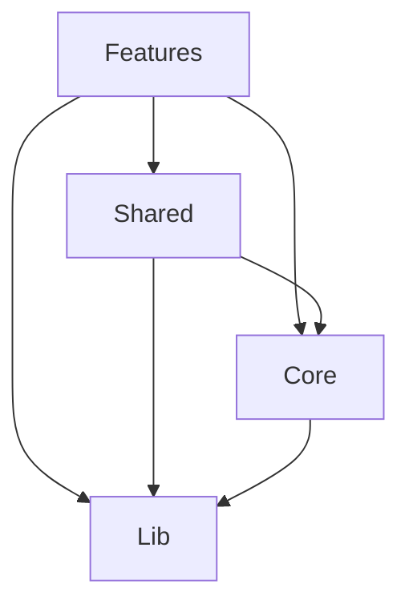

# 🤝 Contributing Guidelines

## Welcome Contributors

Thank you for your interest in contributing to our Feature-Sliced Design React application! This guide will help you understand our development process and coding standards.

## 📋 Table of Contents

1. [Getting Started](#-getting-started)
2. [Development Workflow](#-development-workflow)
3. [Code Standards](#-code-standards)
4. [Feature Development](#️-feature-development)
5. [Testing Requirements](#-testing-requirements)
6. [Pull Request Process](#-pull-request-process)
7. [Architecture Guidelines](#️-architecture-guidelines)

## 🚀 Getting Started

### Prerequisites

- **Node.js**: Version 20 or higher (LTS recommended)
- **npm**: Version 10 or higher
- **Git**: Latest version
- **VS Code**: Recommended IDE with suggested extensions

### Node Version Management

This project requires Node.js 20+. Use the included `.nvmrc` file:

```bash
# Using nvm (recommended)
nvm use

# Or install the specified version
nvm install 20
```

### Installation

```bash
# Clone the repository
git clone https://github.com/your-org/react-fsd.git
cd react-fsd

# Install dependencies
npm install

# Start development server
npm run dev

# Run tests
npm test
```

### Recommended VS Code Extensions

```json
{
  "recommendations": [
    "esbenp.prettier-vscode",
    "bradlc.vscode-tailwindcss",
    "ms-vscode.vscode-typescript-next",
    "orta.vscode-jest",
    "ms-vscode.vscode-eslint"
  ]
}
```

## 🔄 Development Workflow

### Branch Strategy

We follow **GitFlow** with the following branch structure:

```text
main         # Production-ready code
develop      # Integration branch for features
feature/*    # New features
bugfix/*     # Bug fixes
hotfix/*     # Critical production fixes
release/*    # Release preparation
```

### Branch Naming Convention

```bash
# Features
feature/auth-login-form
feature/dashboard-analytics
feature/user-profile-settings

# Bug fixes
bugfix/login-validation-error
bugfix/dashboard-loading-issue

# Hot fixes
hotfix/security-vulnerability-fix
hotfix/critical-auth-bug
```

### Commit Message Format

We use **Conventional Commits** specification:

```text
<type>[optional scope]: <description>

[optional body]

[optional footer(s)]
```

**Types:**

- `feat`: New feature
- `fix`: Bug fix
- `docs`: Documentation changes
- `style`: Code style changes (formatting, etc.)
- `refactor`: Code refactoring
- `test`: Adding or modifying tests
- `chore`: Maintenance tasks

**Examples:**

```bash
# Feature commits
feat(auth): add login form validation
feat(dashboard): implement user analytics widget

# Bug fix commits
fix(auth): resolve login form submission error
fix(ui): correct button hover state in dark mode

# Documentation commits
docs(architecture): update FSD layer documentation
docs(readme): add installation instructions

# Refactoring commits
refactor(auth): extract validation logic to separate service
refactor(shared): optimize common utility functions
```

## 📏 Code Standards

### TypeScript Guidelines

#### Type Definitions

```typescript
// ✅ Good - Clear interface definitions
interface User {
  id: number;
  name: string;
  email: string;
  role: 'admin' | 'user' | 'guest';
  createdAt: string;
}

// ✅ Good - Generic types
interface ApiResponse<T> {
  data: T;
  message: string;
  success: boolean;
}

// ❌ Bad - Using 'any'
interface User {
  id: any;
  data: any;
}
```

#### Function Signatures

```typescript
// ✅ Good - Explicit return types
const fetchUser = async (id: number): Promise<User> => {
  const response = await apiClient.get(`/users/${id}`);
  return response.data;
};

// ✅ Good - Proper error handling
const createUser = async (
  userData: CreateUserRequest
): Promise<Result<User, ApiError>> => {
  try {
    const response = await apiClient.post('/users', userData);
    return { success: true, data: response.data };
  } catch (error) {
    return {
      success: false,
      error: new ApiError('Failed to create user', error),
    };
  }
};
```

### React Component Guidelines

#### Component Structure

```typescript
// ✅ Good - Proper component structure
interface UserCardProps {
  user: User;
  onEdit?: (user: User) => void;
  onDelete?: (userId: number) => void;
  className?: string;
}

export const UserCard = ({
  user,
  onEdit,
  onDelete,
  className
}: UserCardProps) => {
  // Hooks at the top
  const [isLoading, setIsLoading] = useState(false);
  const { t } = useTranslation();

  // Event handlers
  const handleEdit = () => {
    onEdit?.(user);
  };

  const handleDelete = async () => {
    if (window.confirm(t('user.deleteConfirm'))) {
      setIsLoading(true);
      try {
        await onDelete?.(user.id);
      } finally {
        setIsLoading(false);
      }
    }
  };

  // Render
  return (
    <div className={cn('p-4 border rounded-lg', className)}>
      <h3 className="font-semibold">{user.name}</h3>
      <p className="text-gray-600">{user.email}</p>

      <div className="mt-4 flex gap-2">
        <Button onClick={handleEdit} variant="outline">
          {t('common.edit')}
        </Button>
        <Button
          onClick={handleDelete}
          variant="destructive"
          disabled={isLoading}
        >
          {isLoading ? t('common.deleting') : t('common.delete')}
        </Button>
      </div>
    </div>
  );
};
```

#### Hooks Guidelines

```typescript
// ✅ Good - Custom hook with proper typing
export const useAuth = () => {
  const [user, setUser] = useState<User | null>(null);
  const [isLoading, setIsLoading] = useState(true);
  const [error, setError] = useState<string | null>(null);

  const login = useCallback(async (credentials: LoginRequest) => {
    setIsLoading(true);
    setError(null);

    try {
      const result = await authService.login(credentials);
      if (result.success) {
        setUser(result.data.user);
      } else {
        setError(result.error.message);
      }
    } catch (err) {
      setError('An unexpected error occurred');
    } finally {
      setIsLoading(false);
    }
  }, []);

  const logout = useCallback(() => {
    setUser(null);
    setError(null);
  }, []);

  return {
    user,
    isLoading,
    error,
    login,
    logout,
    isAuthenticated: !!user,
  };
};
```

### Styling Guidelines

#### Tailwind CSS Usage

```typescript
// ✅ Good - Semantic class organization
const buttonVariants = {
  primary: 'bg-blue-600 hover:bg-blue-700 text-white',
  secondary: 'bg-gray-200 hover:bg-gray-300 text-gray-900',
  destructive: 'bg-red-600 hover:bg-red-700 text-white',
};

// ✅ Good - Responsive design
<div className="grid grid-cols-1 md:grid-cols-2 lg:grid-cols-3 gap-4">
  {items.map(item => (
    <Card key={item.id} className="p-4">
      {/* Card content */}
    </Card>
  ))}
</div>

// ✅ Good - Dark mode support
<div className="bg-white dark:bg-gray-800 text-gray-900 dark:text-white">
  <h1 className="text-2xl font-bold">Welcome</h1>
</div>
```

## 🏗️ Feature Development

### Feature Creation Checklist

When creating a new feature, ensure you complete these steps:

- [ ] **Plan the feature boundaries and responsibilities**
- [ ] **Create feature directory structure**
- [ ] **Define TypeScript models and interfaces**
- [ ] **Implement services for API communication**
- [ ] **Create state management (stores/queries)**
- [ ] **Build UI components**
- [ ] **Create pages and routing**
- [ ] **Add internationalization**
- [ ] **Write comprehensive tests**
- [ ] **Update documentation**

### Feature Structure Template

````bash
```bash
# Create new feature structure
mkdir -p src/features/[feature-name]/{components,constants,locales,managers,mocks,models,pages,queries,routes,schema,services,stores}
mkdir -p src/features/[feature-name]/{components,managers,services}/__tests__
````

### Registration Steps

1. **Update feature configuration**:

```typescript
// features/configs.ts
export const features = ['auth', 'your-new-feature'];
```

1. **Register routes**:

```typescript
// features/routes.ts
import yourFeatureRoutes from './your-new-feature/routes';
export default [...existingRoutes, ...yourFeatureRoutes];
```

1. **Add locales**:

```typescript
// features/locales.ts
import yourFeatureLocales from './your-new-feature/locales';
const modules = {
  // ... existing modules
  'your-new-feature': yourFeatureLocales,
};
```

## 🧪 Testing Requirements

### Test Coverage Requirements

- **Minimum overall coverage**: 80%
- **Critical business logic**: 95%
- **UI components**: Focus on user interactions
- **Services**: 100% coverage for API calls

### Test Structure

```typescript
// Component tests
describe('ComponentName', () => {
  // Setup
  const defaultProps = {
    /* ... */
  };

  beforeEach(() => {
    jest.clearAllMocks();
  });

  // Rendering tests
  describe('Rendering', () => {
    it('should render correctly with default props', () => {});
    it('should render loading state', () => {});
    it('should render error state', () => {});
  });

  // Interaction tests
  describe('User Interactions', () => {
    it('should handle form submission', () => {});
    it('should handle button clicks', () => {});
  });

  // Edge cases
  describe('Edge Cases', () => {
    it('should handle empty data', () => {});
    it('should handle network errors', () => {});
  });
});
```

### Required Tests

- **Unit Tests**: All utility functions, services, and stores
- **Component Tests**: All UI components with user interactions
- **Integration Tests**: Feature workflows
- **E2E Tests**: Critical user journeys

## 📝 Pull Request Process

### PR Title Format

```text
<type>(scope): <description>

Examples:
feat(auth): add OAuth login integration
fix(dashboard): resolve chart rendering issue
docs(architecture): update FSD documentation
```

### PR Description Template

```markdown
## Description

Brief description of changes made.

## Type of Change

- [ ] Bug fix (non-breaking change which fixes an issue)
- [ ] New feature (non-breaking change which adds functionality)
- [ ] Breaking change (fix or feature that would cause existing functionality to not work as expected)
- [ ] Documentation update

## Testing

- [ ] Unit tests pass
- [ ] Integration tests pass
- [ ] E2E tests pass (if applicable)
- [ ] Manual testing completed

## Screenshots/Demo

Include screenshots or GIFs demonstrating the changes (if applicable).

## Checklist

- [ ] Code follows the style guidelines
- [ ] Self-review completed
- [ ] Code is commented, particularly in hard-to-understand areas
- [ ] Documentation updated (if applicable)
- [ ] Tests added/updated
- [ ] No new warnings or errors introduced
```

### Review Process

1. **Self-Review**: Review your own PR before requesting reviews
2. **Automated Checks**: Ensure all CI checks pass
3. **Peer Review**: At least one team member must approve
4. **Architecture Review**: For significant changes, architect approval required

### Merge Requirements

- [ ] All CI checks pass
- [ ] At least one approval from a team member
- [ ] No unresolved conversations
- [ ] Branch is up to date with target branch
- [ ] All tests pass
- [ ] Code coverage meets requirements

## 🏛️ Architecture Guidelines

### Layer Dependencies



**Rules:**

- ✅ Features can import from Shared, Core, and Lib
- ✅ Shared can import from Core and Lib
- ✅ Core can import from Lib
- ❌ No circular dependencies
- ❌ Features cannot import from other Features directly

### Import Guidelines

```typescript
// ✅ Good - Proper import order
import React from 'react';
import { useQuery } from '@tanstack/react-query';

import { apiClient } from '@/core/api';
import { Button } from '@/shared/components/Button';
import { useFeatureStore } from '../stores/feature.store';

import type { User } from '../models/user.model';

// ❌ Bad - Features importing from other features
import { useAuthStore } from '../../auth/stores/auth.store'; // Don't do this

// ✅ Good - Cross-feature communication through shared layer
import { useAppStore } from '@/shared/stores/app.store';
```

### State Management Guidelines

```typescript
// ✅ Good - Feature-specific state
export const useFeatureStore = create<FeatureState>((set, get) => ({
  // Local feature state
  data: [],
  isLoading: false,
  error: null,

  // Feature-specific actions
  fetchData: async () => {
    // Implementation
  },
}));

// ✅ Good - Global shared state
export const useAppStore = create<AppState>((set, get) => ({
  // Global app state
  user: null,
  theme: 'light',

  // Global actions
  setUser: user => set({ user }),
  setTheme: theme => set({ theme }),
}));
```

## 🚨 Common Mistakes to Avoid

### Architecture Violations

```typescript
// ❌ Bad - Direct feature imports
import { LoginForm } from '../auth/components/LoginForm';

// ❌ Bad - Shared layer importing from features
import { useAuthStore } from '@/features/auth/stores/auth.store';

// ❌ Bad - Circular dependencies
// Feature A importing Feature B, and Feature B importing Feature A
```

### Code Quality Issues

```typescript
// ❌ Bad - Using 'any' type
const handleSubmit = (data: any) => {
  // Implementation
};

// ❌ Bad - Missing error handling
const fetchData = async () => {
  const response = await api.get('/data');
  return response.data; // What if this throws?
};

// ❌ Bad - Inline styles instead of Tailwind
const styles = {
  container: {
    padding: '16px',
    backgroundColor: '#f0f0f0',
  },
};
```

### Testing Anti-patterns

```typescript
// ❌ Bad - Testing implementation details
expect(component.find('.internal-class')).toHaveLength(1);

// ❌ Bad - Brittle tests
expect(screen.getByText('Login')).toBeInTheDocument(); // What if text changes?

// ✅ Good - Testing behavior
expect(screen.getByRole('button', { name: /login/i })).toBeInTheDocument();
```

## 📞 Getting Help

### Communication Channels

- **GitHub Issues**: Bug reports and feature requests
- **GitHub Discussions**: General questions and discussions
- **Slack/Discord**: Real-time communication (if applicable)

### Documentation

- **Architecture**: `/docs/ARCHITECTURE.md`
- **Development**: `/docs/DEVELOPMENT.md`
- **Testing**: `/docs/TESTING.md`
- **Deployment**: `/docs/DEPLOYMENT.md`

### Code Review

- Be constructive and respectful in feedback
- Focus on code quality and maintainability
- Suggest improvements rather than just pointing out problems
- Acknowledge good practices and clean code

Thank you for contributing to our Feature-Sliced Design React application! Your contributions help make this project better for everyone. 🎉
