# 🚀 Development Guidelines

## Adding a New Feature

### Step 1: Planning & Design

Before creating a new feature, plan its boundaries and responsibilities:

```mermaid
flowchart LR
    A[📋 Define Requirements] --> B[🎯 Identify Boundaries]
    B --> C[📊 Design Data Flow]
    C --> D[🔗 Plan Dependencies]
    D --> E[📝 Document Decisions]
```



**Questions to Consider:**

- What business problem does this feature solve?
- What data does it need and produce?
- How will it communicate with other features?
- What shared resources will it use?

### Step 2: Create Feature Structure

Use the following commands to create a new feature:

```bash
# Create feature directory
mkdir -p src/features/[feature-name]

# Create all necessary subdirectories
mkdir -p src/features/[feature-name]/{components,constants,locales,managers,mocks,models,pages,queries,routes,schema,services,stores}

# Create test directories
mkdir -p src/features/[feature-name]/{components,managers,services}/__tests__
```

### Step 3: Implement Feature Slices

#### 1. Models & Types (`models/`)

Define TypeScript interfaces and types first:

```typescript
// models/[feature].model.ts
export interface FeatureData {
  id: string;
  name: string;
  status: 'active' | 'inactive';
  createdAt: string;
}

export interface FeatureState {
  data: FeatureData[];
  isLoading: boolean;
  error: string | null;
}

export interface FeatureFilters {
  status?: 'active' | 'inactive';
  search?: string;
}
```

#### 2. Constants (`constants/`)

Define feature-specific constants:

```typescript
// constants/[feature].constants.ts
export const FEATURE_ROUTES = {
  INDEX: '/feature',
  DETAIL: '/feature/:id',
  CREATE: '/feature/create',
} as const;

export const FEATURE_STATUS = {
  ACTIVE: 'active',
  INACTIVE: 'inactive',
} as const;

export const FEATURE_LIMITS = {
  PAGE_SIZE: 20,
  MAX_NAME_LENGTH: 100,
} as const;
```

#### 3. Services (`services/`)

Implement API communication:

```typescript
// services/[feature].service.ts
import { apiClient } from '@/core/api';
import type { FeatureData, FeatureFilters } from '../models/[feature].model';

export const featureService = {
  async getAll(filters?: FeatureFilters): Promise<FeatureData[]> {
    const response = await apiClient.get('/features', { params: filters });
    return response.data;
  },

  async getById(id: string): Promise<FeatureData> {
    const response = await apiClient.get(`/features/${id}`);
    return response.data;
  },

  async create(
    data: Omit<FeatureData, 'id' | 'createdAt'>
  ): Promise<FeatureData> {
    const response = await apiClient.post('/features', data);
    return response.data;
  },

  async update(id: string, data: Partial<FeatureData>): Promise<FeatureData> {
    const response = await apiClient.patch(`/features/${id}`, data);
    return response.data;
  },

  async delete(id: string): Promise<void> {
    await apiClient.delete(`/features/${id}`);
  },
};
```

#### 4. Stores (`stores/`)

Create state management:

```typescript
// stores/[feature].store.ts
import { create } from 'zustand';
import type { FeatureState, FeatureData } from '../models/[feature].model';

interface FeatureStore extends FeatureState {
  // Actions
  setData: (data: FeatureData[]) => void;
  addItem: (item: FeatureData) => void;
  updateItem: (id: string, updates: Partial<FeatureData>) => void;
  removeItem: (id: string) => void;
  setLoading: (isLoading: boolean) => void;
  setError: (error: string | null) => void;
  reset: () => void;
}

const initialState: FeatureState = {
  data: [],
  isLoading: false,
  error: null,
};

export const useFeatureStore = create<FeatureStore>((set, get) => ({
  ...initialState,

  setData: data => set({ data, error: null }),

  addItem: item =>
    set(state => ({
      data: [...state.data, item],
    })),

  updateItem: (id, updates) =>
    set(state => ({
      data: state.data.map(item =>
        item.id === id ? { ...item, ...updates } : item
      ),
    })),

  removeItem: id =>
    set(state => ({
      data: state.data.filter(item => item.id !== id),
    })),

  setLoading: isLoading => set({ isLoading }),

  setError: error => set({ error, isLoading: false }),

  reset: () => set(initialState),
}));
```

#### 5. Queries (`queries/`)

Implement data fetching with TanStack Query:

```typescript
// queries/[feature].query.ts
import { useQuery, useMutation, useQueryClient } from '@tanstack/react-query';
import { featureService } from '../services/[feature].service';
import { useFeatureStore } from '../stores/[feature].store';
import type { FeatureData, FeatureFilters } from '../models/[feature].model';

const QUERY_KEYS = {
  all: ['features'] as const,
  lists: () => [...QUERY_KEYS.all, 'list'] as const,
  list: (filters?: FeatureFilters) => [...QUERY_KEYS.lists(), filters] as const,
  details: () => [...QUERY_KEYS.all, 'detail'] as const,
  detail: (id: string) => [...QUERY_KEYS.details(), id] as const,
};

export const useFeatures = (filters?: FeatureFilters) => {
  const { setData, setLoading, setError } = useFeatureStore();

  return useQuery({
    queryKey: QUERY_KEYS.list(filters),
    queryFn: () => featureService.getAll(filters),
    onSuccess: data => {
      setData(data);
      setLoading(false);
    },
    onError: error => {
      setError(error.message);
    },
  });
};

export const useFeature = (id: string) => {
  return useQuery({
    queryKey: QUERY_KEYS.detail(id),
    queryFn: () => featureService.getById(id),
    enabled: !!id,
  });
};

export const useCreateFeature = () => {
  const queryClient = useQueryClient();
  const { addItem } = useFeatureStore();

  return useMutation({
    mutationFn: featureService.create,
    onSuccess: data => {
      addItem(data);
      queryClient.invalidateQueries({ queryKey: QUERY_KEYS.lists() });
    },
  });
};

export const useUpdateFeature = () => {
  const queryClient = useQueryClient();
  const { updateItem } = useFeatureStore();

  return useMutation({
    mutationFn: ({ id, ...data }: { id: string } & Partial<FeatureData>) =>
      featureService.update(id, data),
    onSuccess: data => {
      updateItem(data.id, data);
      queryClient.invalidateQueries({ queryKey: QUERY_KEYS.detail(data.id) });
      queryClient.invalidateQueries({ queryKey: QUERY_KEYS.lists() });
    },
  });
};
```

#### 6. Components (`components/`)

Create reusable UI components:

```typescript
// components/FeatureList/index.tsx
import { useFeatures } from '../../queries/[feature].query';
import { FeatureCard } from './FeatureCard';
import { LoadingSpinner } from '@/shared/components/LoadingSpinner';
import { ErrorMessage } from '@/shared/components/ErrorMessage';
import type { FeatureFilters } from '../../models/[feature].model';

interface FeatureListProps {
  filters?: FeatureFilters;
  onItemClick?: (id: string) => void;
}

export const FeatureList = ({ filters, onItemClick }: FeatureListProps) => {
  const { data, isLoading, error } = useFeatures(filters);

  if (isLoading) return <LoadingSpinner />;
  if (error) return <ErrorMessage message={error.message} />;
  if (!data?.length) return <div>No features found</div>;

  return (
    <div className="grid gap-4 md:grid-cols-2 lg:grid-cols-3">
      {data.map((feature) => (
        <FeatureCard
          key={feature.id}
          feature={feature}
          onClick={() => onItemClick?.(feature.id)}
        />
      ))}
    </div>
  );
};
```

#### 7. Pages (`pages/`)

Create page components:

```typescript
// pages/[feature].page.tsx
import { useState } from 'react';
import { FeatureList } from '../components/FeatureList';
import { FeatureFilters } from '../components/FeatureFilters';
import { CreateFeatureDialog } from '../components/CreateFeatureDialog';
import { Button } from '@/lib/shadcn/components/ui/button';
import type { FeatureFilters as Filters } from '../models/[feature].model';

export const FeaturePage = () => {
  const [filters, setFilters] = useState<Filters>({});
  const [showCreateDialog, setShowCreateDialog] = useState(false);

  const handleItemClick = (id: string) => {
    // Navigate to detail page
    console.log('Navigate to feature:', id);
  };

  return (
    <div className="container mx-auto py-8">
      <div className="flex justify-between items-center mb-6">
        <h1 className="text-3xl font-bold">Features</h1>
        <Button onClick={() => setShowCreateDialog(true)}>
          Create Feature
        </Button>
      </div>

      <div className="mb-6">
        <FeatureFilters
          filters={filters}
          onFiltersChange={setFilters}
        />
      </div>

      <FeatureList
        filters={filters}
        onItemClick={handleItemClick}
      />

      <CreateFeatureDialog
        open={showCreateDialog}
        onOpenChange={setShowCreateDialog}
      />
    </div>
  );
};
```

#### 8. Routes (`routes/`)

Configure routing:

```typescript
// routes/[feature].route.ts
import { createRoute } from '@tanstack/react-router';
import { rootRoute } from '@/core/router';
import { FeaturePage } from '../pages/[feature].page';
import { FeatureDetailPage } from '../pages/[feature]-detail.page';
import { FEATURE_ROUTES } from '../constants/[feature].constants';

const featureIndexRoute = createRoute({
  path: FEATURE_ROUTES.INDEX,
  getParentRoute: () => rootRoute,
  component: FeaturePage,
});

const featureDetailRoute = createRoute({
  path: FEATURE_ROUTES.DETAIL,
  getParentRoute: () => rootRoute,
  component: FeatureDetailPage,
});

export const featureRoutes = [featureIndexRoute, featureDetailRoute];
```

#### 9. Locales (`locales/`)

Add internationalization:

```json
// locales/en.json
{
  "feature": {
    "title": "Features",
    "create": "Create Feature",
    "edit": "Edit Feature",
    "delete": "Delete Feature",
    "status": {
      "active": "Active",
      "inactive": "Inactive"
    },
    "fields": {
      "name": "Name",
      "status": "Status",
      "createdAt": "Created At"
    },
    "messages": {
      "createSuccess": "Feature created successfully",
      "updateSuccess": "Feature updated successfully",
      "deleteSuccess": "Feature deleted successfully",
      "deleteConfirm": "Are you sure you want to delete this feature?"
    }
  }
}
```

#### 10. Tests (`__tests__/`)

Write comprehensive tests:

```typescript
// components/__tests__/FeatureList.test.tsx
import { render, screen } from '@testing-library/react';
import { QueryClient, QueryClientProvider } from '@tanstack/react-query';
import { FeatureList } from '../FeatureList';
import * as featureQuery from '../../queries/[feature].query';

// Mock the query hook
jest.mock('../../queries/[feature].query');

const mockUseFeatures = featureQuery.useFeatures as jest.MockedFunction<typeof featureQuery.useFeatures>;

const createWrapper = () => {
  const queryClient = new QueryClient({
    defaultOptions: { queries: { retry: false } },
  });

  return ({ children }: { children: React.ReactNode }) => (
    <QueryClientProvider client={queryClient}>
      {children}
    </QueryClientProvider>
  );
};

describe('FeatureList', () => {
  beforeEach(() => {
    jest.clearAllMocks();
  });

  it('should render loading state', () => {
    mockUseFeatures.mockReturnValue({
      data: undefined,
      isLoading: true,
      error: null,
    } as any);

    render(<FeatureList />, { wrapper: createWrapper() });

    expect(screen.getByText('Loading...')).toBeInTheDocument();
  });

  it('should render features when loaded', () => {
    const mockData = [
      { id: '1', name: 'Feature 1', status: 'active', createdAt: '2024-01-01' },
      { id: '2', name: 'Feature 2', status: 'inactive', createdAt: '2024-01-02' },
    ];

    mockUseFeatures.mockReturnValue({
      data: mockData,
      isLoading: false,
      error: null,
    } as any);

    render(<FeatureList />, { wrapper: createWrapper() });

    expect(screen.getByText('Feature 1')).toBeInTheDocument();
    expect(screen.getByText('Feature 2')).toBeInTheDocument();
  });
});
```

### Step 4: Register Feature

#### 1. Update Feature Configuration

```typescript
// features/configs.ts
export const supportedLanguages = ['en'];
export const features = ['auth', 'your-new-feature']; // Add your feature

const moduleConfig = {
  supportedLanguages,
  features,
};

export default moduleConfig;
```

#### 2. Register Routes

```typescript
// features/routes.ts
import authRoutes from './auth/routes';
import { featureRoutes } from './your-new-feature/routes'; // Import your routes

export default [...authRoutes, ...featureRoutes]; // Add your routes
```

#### 3. Add Locales

```typescript
// features/locales.ts
import { generateResources } from '@/shared/utils/common.utils';
import authLocales from './auth/locales';
import featureLocales from './your-new-feature/locales'; // Import your locales
import moduleConfig from './configs';

const modules = {
  auth: authLocales,
  'your-new-feature': featureLocales, // Add your locales
};

const { supportedLanguages, features } = moduleConfig;

const localesConfig = generateResources({
  supportedLanguages,
  features,
  modules,
});

export default localesConfig;
```

#### 4. Register Mocks (if needed)

```typescript
// features/mocks.ts
import authHandlers from './auth/mocks';
import featureHandlers from './your-new-feature/mocks'; // Import your mocks

const mocks = [...authHandlers, ...featureHandlers]; // Add your mocks

export default mocks;
```

## Best Practices

### 1. Naming Conventions

- **Files**: `kebab-case.extension.ts`
- **Components**: `PascalCase`
- **Functions/Variables**: `camelCase`
- **Constants**: `SCREAMING_SNAKE_CASE`
- **Types/Interfaces**: `PascalCase`

### 2. File Organization

```Directory

feature/
├── components/           # Reusable UI components
│   ├── FeatureList/
│   │   ├── index.tsx    # Main component
│   │   ├── FeatureCard.tsx # Sub-components
│   │   └── __tests__/
├── constants/           # Feature constants
├── locales/            # i18n translations
├── managers/           # Complex business logic
├── mocks/             # MSW handlers
├── models/            # TypeScript types
├── pages/             # Route components
├── queries/           # TanStack Query hooks
├── routes/            # Router configuration
├── schema/            # Validation schemas
├── services/          # API communication
└── stores/            # State management
```

### 3. Import Organization

```typescript
// 1. React and third-party imports
import React from 'react';
import { useQuery } from '@tanstack/react-query';

// 2. Core layer imports
import { apiClient } from '@/core/api';

// 3. Shared layer imports
import { Button } from '@/shared/components/Button';
import { useCommonStore } from '@/shared/stores/common.store';

// 4. Feature-specific imports (within same feature)
import { useFeatureStore } from '../stores/feature.store';
import { FeatureCard } from './FeatureCard';

// 5. Type imports (separate from value imports)
import type { FeatureData } from '../models/feature.model';
```

### 4. Error Handling

```typescript
// Service layer
export const featureService = {
  async getAll(): Promise<Result<FeatureData[], ApiError>> {
    try {
      const response = await apiClient.get('/features');
      return { success: true, data: response.data };
    } catch (error) {
      return {
        success: false,
        error: new ApiError('Failed to fetch features', error)
      };
    }
  }
};

// Component layer
const { data, error, isLoading } = useFeatures();

if (error) {
  return <ErrorBoundary error={error} />;
}
```

### 5. Testing Strategy

- **Unit Tests**: Individual functions and components
- **Integration Tests**: Feature workflows
- **E2E Tests**: User journeys across features

```typescript
// Test structure
describe('Feature', () => {
  describe('Component', () => {
    it('should render correctly', () => {});
    it('should handle user interactions', () => {});
    it('should handle error states', () => {});
  });

  describe('Service', () => {
    it('should make correct API calls', () => {});
    it('should handle API errors', () => {});
  });

  describe('Store', () => {
    it('should update state correctly', () => {});
    it('should handle complex state changes', () => {});
  });
});
```

This completes the comprehensive guide for adding new features to your FSD architecture. Each new feature should follow this exact pattern for consistency and maintainability.
